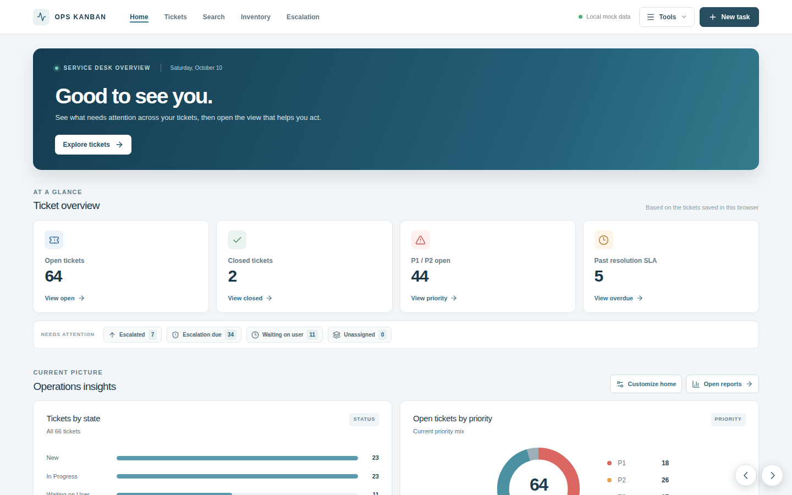
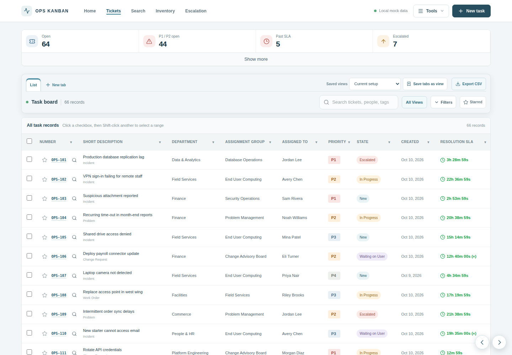
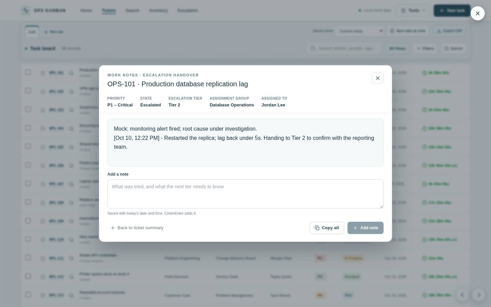
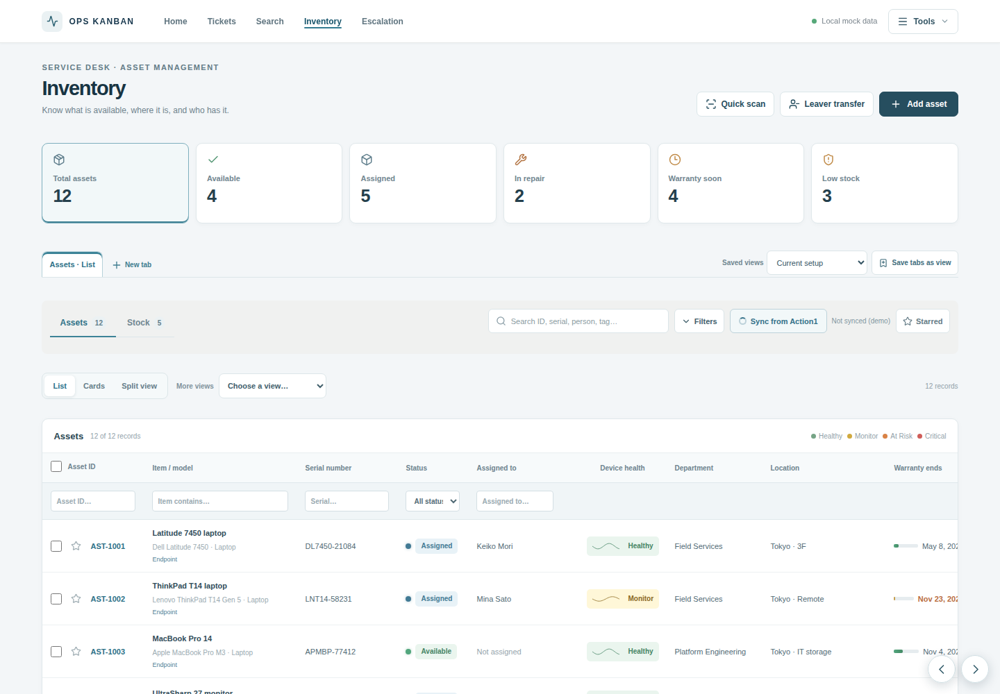

# IT Ticket Board

[](LICENSE)
[](https://github.com/yuki-kat/it-ticket-board/actions)

An **IT service desk board** for tickets, SLAs, escalation and asset inventory. It runs two ways:

- **As one file, offline.** Double-click `index.html`. No install, no server, and your data stays in your browser.
- **Hosted, with accounts.** The hosted site adds sign-in, shared team escalation settings and AI-suggested fixes, backed by a small Node + Postgres server.

**Try it:** download [`index.html`](index.html) and open it, or use the [hosted site](https://it-ticket-board-frontend.onrender.com) (free hosting, so the first visit can take about a minute to wake up). Both start with sample tickets and assets.

<table>
  <tr>
    <td></td>
    <td></td>
  </tr>
  <tr>
    <td align="center"><b>Home</b>: what needs attention right now</td>
    <td align="center"><b>Tickets</b>: list view with live SLA timers</td>
  </tr>
  <tr>
    <td></td>
    <td></td>
  </tr>
  <tr>
    <td align="center"><b>Work notes</b>: one view for escalation handovers</td>
    <td align="center"><b>Inventory</b>: who has which device, and its health</td>
  </tr>
</table>

## ✨ Features

- **📋 Ticket views**: Kanban, list, split, calendar, analytics and more, with saved views, tabs and a State dropdown on every ticket
- **⏱️ Live SLA timers**: count down to the second and show overdue time. Pausing and resuming is logged to the work notes. The clock pauses automatically while a ticket is *Waiting on User* and stops at *Resolved*, following the same pattern as ServiceNow's "On Hold – Awaiting Caller"
- **🤖 Find resolution**: AI-suggested fixes from Google Gemini (hosted site, after signing in)
- **📞 Call user**: start a Teams, Zoom or Webex call from a ticket and log how it went to the work notes
- **📝 Work notes for escalation**: a large view of a ticket's notes with its priority, state, tier and owner, a box for timestamped notes, and **Copy all** to paste the handover into an email or Teams
- **🏠 Operations dashboard**: KPI cards, insights, and an Explore page for drilling into queues
- **🚨 Escalation**: teams with admin and member roles, assignment groups, escalation rules, time thresholds per priority, and uploaded reference documents (escalation and SLA matrices)
- **📦 Asset & stock inventory**: assign and return devices, track history, device health and stock levels, and link assets to tickets. **Quick scan** finds a device by serial or asset tag (or checks a batch back in), **bulk actions** work on shift-click selections, and **Leaver transfer** moves everything a departing person holds in one step
- **📧 Email-to-ticket**: draft a ticket from pasted email text
- **📊 Exports**: CSV and two-sheet Excel workbooks
- **👥 Workspaces & sync**: share one board across a team (Supabase)
- **💾 Backup & restore**: download everything as JSON and restore it later
- **🌐 Works offline**: the single file needs no internet

## 🚀 Quick start

### Offline, on your own computer

1. Download or clone this repo.
2. Double-click **`index.html`**.

Open it from the file system rather than a local web server. Saved data belongs to that file: a copy with a different name or location starts fresh. To keep your data, save a new version over the old file, or use **Settings → Backup and restore**.

### Hosted

Open **https://it-ticket-board-frontend.onrender.com** and sign in (see [Accounts and admins](#accounts-and-admins)). The backend runs on Render's free plan, which sleeps after 15 minutes without traffic, so the first request after a quiet spell can take about a minute.

---

## How it is put together

| Folder | What it holds |
| --- | --- |
| `app/` | The front end: React + TypeScript, built with Vite. Every UI change is made here. |
| `index.html` | **Built from `app/`** into one self-contained file (`cd app && npm run build:page`). Don't edit it by hand. |
| `server/` | The backend: Express + Postgres. Handles sign-in, teams, escalation settings, document uploads and the Gemini proxy. |
| `tests/` | Playwright browser tests that open `index.html` exactly as it ships. |
| `supabase/` | SQL for workspaces and sync. |
| `legacy/` | The old compiled page, kept for comparison. |

## Making changes

You need Node.js 22, and Google Chrome for the tests.

1. Create a branch (for example `fix-insight-popup`). Never commit straight to `main`, because every merge into `main` goes live.
2. Edit the source in `app/src/` (and `server/src/` for the backend). To try the front end while you work: `cd app && npm ci && npm run dev`.
3. Rebuild the page and run the tests:

   ```bash
   cd app && npm run build:page
   cd ../tests && npm ci && npm test
   ```

4. Commit **both** the source and the rebuilt `index.html`, push, and open a pull request. GitHub rebuilds the page and **fails the pull request if `index.html` is out of date**.
5. Merge once the **Browser tests** check is green.

See [CONTRIBUTING.md](CONTRIBUTING.md) for more.

### Running the backend locally

```bash
cd server
npm ci
cp .env.example .env      # then set DATABASE_URL, JWT_SECRET and GEMINI_API_KEY
npm run migrate           # creates or updates the tables; safe to run again
npm run dev               # http://localhost:3001
```

## Hosting (Render)

`render.yaml` defines everything, and Render deploys it whenever `main` changes:

- **it-ticket-board-backend**: the Node server. Every start runs `npm run migrate` first. If a deploy fails, the previous version keeps running.
- **it-ticket-board-frontend**: the built React app as a static site, with security headers that block framing and MIME sniffing, set a strict referrer policy, and turn off camera, microphone and location.
- **postgres**: Postgres 16.

The site is public, and anyone can create an account.

**Environment variables to set in the Render dashboard** (backend service → Environment):

| Variable | Why |
| --- | --- |
| `JWT_SECRET` | **Required.** Signs sign-in tokens. Use a long random string (`openssl rand -base64 48`). With `NODE_ENV=production`, the server refuses to start if it's missing or left at a placeholder. Outside production it falls back to a development value that is public in this repo. |
| `GEMINI_API_KEY` | Needed for **Find resolution**. Get one from Google AI Studio. |
| `GEMINI_MODELS` | Optional. A comma-separated list of models to try in order. See `server/.env.example` for the defaults. |

## Accounts and admins

There are two separate sign-ins, for different features:

- **Tools → Sign in** (email and password, handled by this repo's server). Needed for **Find resolution** and the **Escalation** page.
- **Settings → Account** (an email link, handled by Supabase). Needed for **workspaces and sync**.

Roles on the Escalation page:

- **Team admin.** Whoever creates a team is its admin. Admins add people by email (they must have signed up first), change roles, and edit groups, rules, thresholds and documents. Members get a read-only view. A team always keeps at least one admin.
- **System admin.** Can manage every team. Set it in the database: `UPDATE users SET is_system_admin = TRUE WHERE lower(email) = lower('you@example.com');`

### Test admin accounts

`server/scripts/seed-admins.ts` creates two system-admin accounts. They are ordinary accounts with properly hashed passwords, not a way around sign-in. No credentials are stored in the repo: set them through environment variables, or leave the passwords unset and the script generates them and prints them once.

```bash
cd server
DATABASE_URL='postgres://…' npx tsx scripts/seed-admins.ts
```

Optional variables: `SEED_ADMIN1_EMAIL`, `SEED_ADMIN1_PASSWORD` and `SEED_ADMIN1_NAME`, and the same for `SEED_ADMIN2`. The defaults are `admin1@test.local` and `admin2@test.local`. Running it again resets the passwords. Change or remove these accounts before real use.

## Database and workspaces (Supabase)

Workspaces and sync use Supabase, set up by two files in `supabase/`. Run each once, in order, in Supabase: **SQL Editor → New query → paste the file → Run**. Both are safe to run again.

1. `schema.sql`: the tables for tickets, deleted tickets, assets, stock and personal settings.
2. `002_workspaces.sql`: **company workspaces**. Tickets, assets and stock belong to a workspace instead of one person, so several IT staff can share them. Existing data is kept.

For the email-link sign-in to return to the hosted site, open Supabase → Authentication → URL Configuration, set **Site URL** to `https://it-ticket-board-frontend.onrender.com`, and add it under **Redirect URLs**.

Workspace roles: an **admin** can invite people, change roles and remove members; an **agent** can work with the workspace's tickets, assets and stock. Access is enforced by the database's row level security, not by the app, so a member never sees another workspace's data.

## Sync

**Settings → Account → Sync** keeps the board in the workspace's database, so everyone in the workspace works from the same tickets, deleted tickets, assets and stock. Settings stay personal.

- A change is sent about a second after it is made. The top bar shows **Saving…**, then **Saved to** the workspace.
- The workspace is read every 30 seconds while the page is visible, and whenever the window gets focus or the connection comes back. **Sync now** in Settings does both straight away.
- With no connection, changes wait in the browser (also across a reload) and are sent when the connection is back.
- If two people change the same ticket, the change sent last wins for the whole ticket.
- Before sync starts, what the browser had is kept: **Backup and restore → Put it back** returns to it and stops syncing.

The rules are in `app/src/syncLogic.ts`, and sending and reading in `app/src/cloudSync.ts`.

SLA pause state is kept in each browser and is not synced yet.

## Backup and restore

**Settings → Backup and restore** downloads everything saved in the browser as one JSON file (`it-ticket-board-backup-YYYY-MM-DD.json`) and can restore from one. Restoring compares the file with what's in the browser and checks the file first, so a bad file changes nothing. It keeps the replaced data, so the last restore can be undone with **Put it back**.

File format (`format: 1`): `{ app, format, createdAt, counts, records: { tickets, deletedTickets, assets, stock }, settings }`. The code is in `app/src/backup.ts`.

## What is in the source

- **Tickets** (`pages/App.tsx`): views, saved views, tabs, the ticket record panel (State dropdown, Find resolution, Call user), and exports.
- **SLA timers** (`components/CompactSLATimer.tsx`, `utils/slaPause.ts`): the per-second countdown, pause and resume, and automatic pausing by status.
- **Escalation** (`pages/EscalationPage.tsx`, `components/TeamMembers.tsx`, `AssignmentGroupManager.tsx`, `EscalationMatrixBuilder.tsx`, `ThresholdsManager.tsx`, `MatrixUploadManager.tsx`): teams, members, groups, rules, thresholds and documents.
- **Home and Explore** (`HomePopouts.tsx`, `HomeInsights.tsx`, `ExplorePage.tsx`): dashboard cards, insights and queue drill-down.
- **Inventory** (`pages/InventoryPage.tsx`, `InventoryView.tsx`): assets and stock.
- **Page addresses** (`lib/route.ts`): `#/home`, `#/tickets`, `#/inventory`, `#/search`, `#/explore/…`, `#/escalation` and `#/signin`. Back, Forward, refresh and bookmarks all work.
- **Backend** (`server/src/api/`): `auth`, `teams`, `escalation-matrix` (uploads are stored in Postgres, up to 10 MB each), `escalation-advanced` (groups, rules, thresholds), and the Gemini proxy (`utils/gemini.ts`, which falls back across models and retries rate limits).

## Automated tests

The browser tests in `tests/` open the real `index.html` in Chrome and click through the app: Home and Explore, every popup, page addresses, insights, opening tickets, SLA pause and resume, the State dropdown, Find resolution, team pages and thresholds, Inventory, every export, backups, sign-in, workspaces and sync. Each test starts with a fresh browser profile. Tests that need a server talk to stand-ins (`tests/fake-supabase.ts` and per-test fake backends), so they need no account and no network.

```bash
cd tests && npm ci && npm test
```

`npm run test:headed` shows the browser while it runs. GitHub runs the same tests on every pull request and on `main`; the result shows as **Browser tests**. If a run fails, open it on the Actions tab and download the `playwright-report` file.
